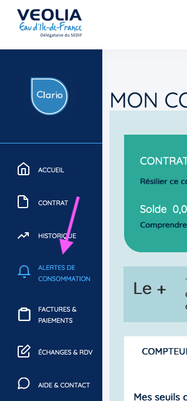
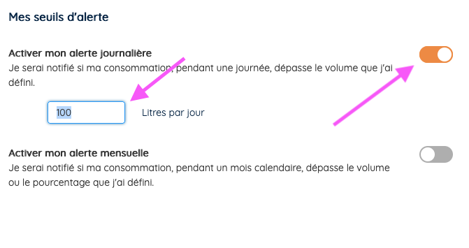

# mail-veolia-wrapper

Ce wrapper extrait les données de consommation d'eau de la plateforme Téléo de Veolia. Il fonctionne parfaitement avec la plateforme **VEOLIA Eau d'Ile-de-France Délégataire du SEDIF**.

Contrairement aux autres solutions disponibles sur Internet, cette solution repose sur l'analyse des mails d'alertes reçus régulièrement _(avec 2j de décalage)_.

Cette approche est séduisante par plusieurs aspects:

- les données sont lues par le biais d'un système tiers maitrisé _(un compte mail)_
- et ne necessite pas le scraping du site web de la plateforme Veolia qui pourrait être indisponible ou avoir évoluée nécessitant une refonte des scripts
- vous n'avez pas besoin de fournir votre mot de passe Veolia au programme
- l'analyse des données peut se faire en 10 petites lignes de code
- les données lues sont stockées dans une base de données SQLite dédiée
- ...

Pour utiliser ce script et collecter vos données, vous aurez besoin :

- d'un mail dédié _(préconisé car chaque mail lu et traité sera supprimé)_
- d'accéder à la plateforme
- créer une alerte pointant sur votre mail

# Créer un mail dédié

Si vous êtes client free, il est assez simple de créer un mail technique pour vos besoins.
A titre indicatif, connectez-vous au [portail free](https://portail.free.fr/). Dès la page principale vous aurez une partie "Mes emails" de disponible. **Gérer mes emails** permet de créer un mail dédié.

# Créer une alerte de consommation

Une fois connecté à la la plateforme Veolia, allez dans l'onglet **Alertes de consommation**.



Puis créer une alerte avec une valeur assez basse pour enclencher un alerte journalière (10L est le minimum).



Indiquer votre mail et attendez au moins de 2 jours!

# Créer un cron pour récupérer les données

La manière la plus simple de collecter vos données de consommation est encore de paramètrer un "cron". A la maison, je reçois généralement les mails d'alerte vers 7h du matin.

En créant un cron journalier à 8h du matin, ça devrait être bon :)

`0 8 * * * ./collect-veolia-data.sh`

avec dans `collect-veolia-data.sh`

## Avec docker

```
#!/bin/sh
/usr/bin/docker run --rm -d \
	-e PASSWORD=xxx \
	-e EMAIL=xxxxx@free.fr \
	-e DATABASE=/database/water.db \
	-e AFTER_PROCESS=REMOVE \
	-v /votre/repertoire/local:/database \
	-m 128M \
		ghcr.io/sylvek/collect-veolia-data \
			2>&1 1>/root/collect-veolia-data.log
```

## Directement via Ruby installé sur votre ordinateur

```
au préalable assurez d'avoir la librairie ruby de sqlite3
> gem install sqlite3
```

```
#!/bin/sh
PASSWORD=xxx \
EMAIL=xxxxx@free.fr \
AFTER_PROCESS=REMOVE \
ruby main.rb \
 2>&1 1>/root/collect-veolia-data.log
```

## Lire les données collectées

Les données sont écrites dans une base de données SQLite3 dans un format "timeseries". A la maison, j'utilise Grafana ainsi que son plugin SQLite pour afficher les données.

voici ce que vous aurez en lisant la base `water.db`

```
sqlite> select * from data;
1|1671062400|daily_water_consumption|liter|177.0
2|1671148800|daily_water_consumption|liter|258.0
3|1671235200|daily_water_consumption|liter|128.0
4|1671321600|daily_water_consumption|liter|264.0
```
